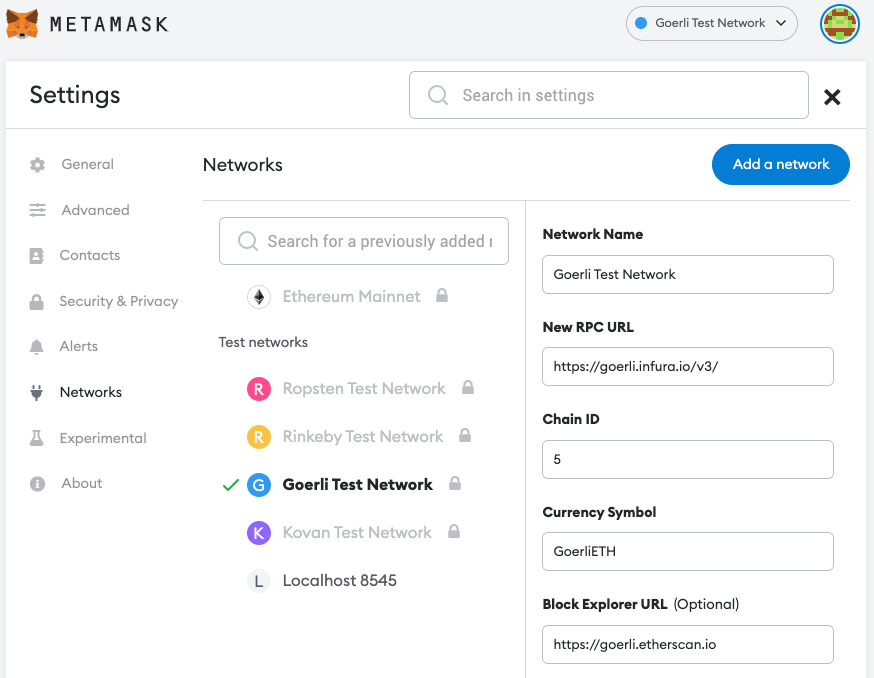
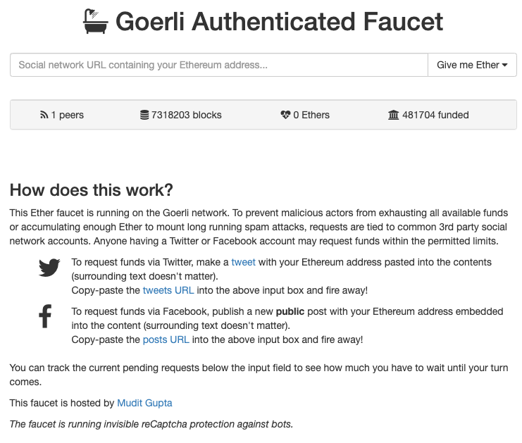
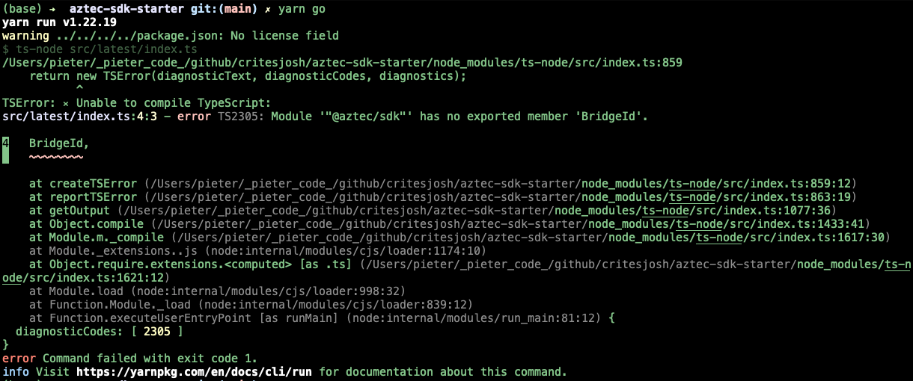
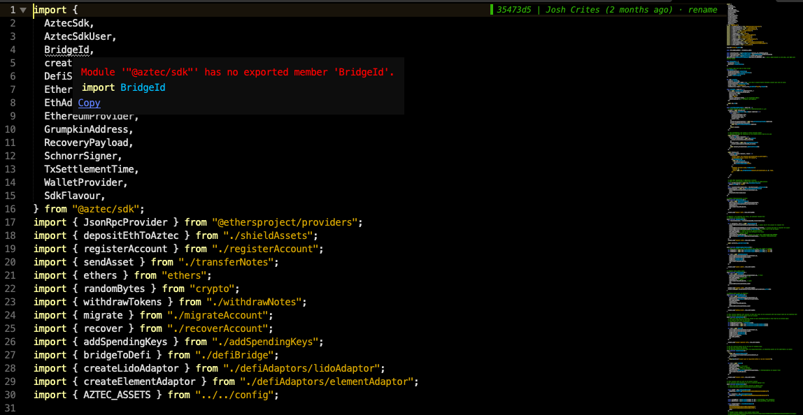
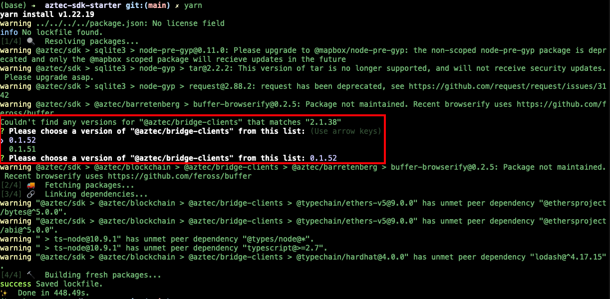
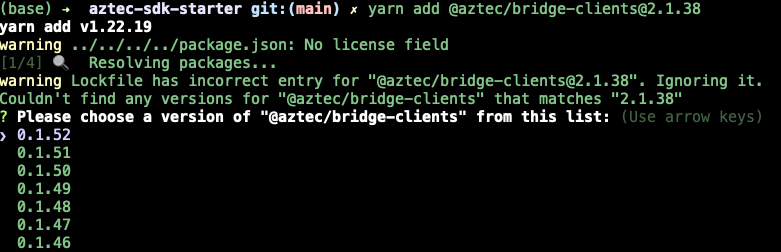

# Getting Started with a Web 3.0 Aztec Protocol Project
  
## Introduction

### The Purpose of this Learning Path, or Developer Journey   
The purpose of this tutorial repository is to provide a Web 3.0 Aztec Network getting started learning path for Web 2.0 developers who are new to working with Aztec technology and Web 3.0 in general.  

### An important note!

I include several screenshots in this tutorial.  

These screenshots are not necessarily applicable to your own personal developer path and experience.  

However, I offer them as a general guide.  

### What is Aztec Network?  
Aztec is an open source layer 2 network that aims to bring scalability and privacy to Ethereum. It strives to enable affordable, private crypto payments via zero-knowledge proofs.  

### From the [Aztec Vision](https://aztec.network/vision) website  
  - [https://aztec.network/vision](https://aztec.network/vision)

Privacy isn't just a human right, it's a tool for creativity. With privacy by default, the world of games, NFTs, and DeFi applications just got bigger. Aztec is an open source layer 2 network that aims to bring scalability and privacy to Ethereum. It strives to enable affordable, private crypto payments via zero-knowledge proofs. Aztec is built from the ground up to be privacy-first. 

---

# Prerequisite steps: Begin Here

## Read the Aztec Protocol/Network Related Documentation

- ### Aztec Network Introduction  
  - [https://docs.aztec.network/](https://docs.aztec.network/)

- ### The Privacy Layer for Web3]
  - [https://aztec.network/](https://docs.aztec.network/)

- ### An Introduction to AZTEC
  - [https://medium.com/aztec-protocol/an-introduction-to-aztec-47c70e875dc7](https://medium.com/aztec-protocol/an-introduction-to-aztec-47c70e875dc7)

- ### Aztec Protocol blog articles on Medium
  - [https://medium.com/aztec-protocol](https://medium.com/aztec-protocol) 

- ### Privacy Tech in Review: ZK Money
  - [https://medium.com/zero-knowledge-validator/privacy-tech-in-review-zk-money-efb59f879043](https://medium.com/zero-knowledge-validator/privacy-tech-in-review-zk-money-efb59f879043)

## Watch the Aztec Videos
- ### Aztec Talks and Videos
  - [https://docs.aztec.network/how-aztec-works/talks-videos](https://docs.aztec.network/how-aztec-works/talks-videos)

- ### Aztec 2.0 - A new layer 2 built with privacy at its core" - Joe Andrews
  - https://www.youtube.com/watch?v=ksmJahvYKSc

- ### Aztec - Joe Andrews (CPO) and Zac Williamson (CTO)
  - https://www.youtube.com/watch?v=NyBwdcIMT0M

- ### Privacy on blockchains and future of rollups | Joe from Aztec
  - [https://www.youtube.com/watch?v=3ZxyHTlkH9E](https://www.youtube.com/watch?v=3ZxyHTlkH9E)

---  

## Install Discord 
Discord will help you to communicate with the Aztec Network Developer Relations Engineering team.

- ### Discord Desktop Installation Guide
  - [https://support.discord.com/hc/en-us/articles/360034561191-Desktop-Installation-Guide](https://support.discord.com/hc/en-us/articles/360034561191-Desktop-Installation-Guide)

- ### Download Discord
  - [https://discord.com/download](https://discord.com/download)

---  

## Set up a MetaMask Wallet

- ### Install MetaMask for Chrome

  - [https://metamask.io/download/](https://metamask.io/download/)

<p align="center">
  
</p>  

<p align="center">
  
</p>  

<p align="center">
  
</p>  

- ### How to set up an Ethereum wallet on MetaMask
  - [https://codehs.com/tutorial/jkeesh/how-to-set-up-an-ethereum-wallet-on-metamask](https://codehs.com/tutorial/jkeesh/how-to-set-up-an-ethereum-wallet-on-metamask)

---  

## How to set up the Goerli Development Testnet  
- ### Web3 Tutorial: Metamask and Goerli Testnet
  - [https://www.youtube.com/watch?v=odD29qGrdtQ](https://www.youtube.com/watch?v=odD29qGrdtQ/)

- ### Goerli (Görli)Testnet Network to MetaMask and Receiving Test Ethereum in Less than 2 Min
  - [https://blog.cryptostars.is/goerli-g%C3%B6rli-testnet-network-to-metamask-and-receiving-test-ethereum-in-less-than-2-min-de13e6fe5677](https://blog.cryptostars.is/goerli-g%C3%B6rli-testnet-network-to-metamask-and-receiving-test-ethereum-in-less-than-2-min-de13e6fe5677)
  
After following the previous tutorials you should be able to see something similar to this MetaMask network configuration:    
    
<p align="center">
  
</p>  

<p align="center">
  
</p>  

- ### The Goerli Authenticated Faucet HowTo
  - [https://goerli-faucet.mudit.blog/](https://goerli-faucet.mudit.blog/)

<p align="center">
  
</p>  

---
## Potential Goerli Testnet Faucet Issues  
  
It is possible that you might run into issues with the Goerli Testnet Faucet, such as the one documented here:  

- [Goerli Authenticated Faucet unable to dispense funds](https://github.com/eth-clients/goerli/issues/85)
  - [https://github.com/eth-clients/goerli/issues/85](https://github.com/eth-clients/goerli/issues/85)

<p align="center">
  
</p>  

**In this case, it is recommended to set up a development environment using the Aztec Mainnet Fork as documented below.**  
  

---  

## How to set up the Aztec Mainnet Fork for Development  

### Please refer to the following:  

- [Aztec SDK Reference script](https://github.com/critesjosh/aztec-sdk-starter#aztec-sdk-reference-script)
  - [https://github.com/critesjosh/aztec-sdk-starter#aztec-sdk-reference-script](https://github.com/critesjosh/aztec-sdk-starter#aztec-sdk-reference-script)
- [Requirements](https://github.com/critesjosh/aztec-sdk-starter#requirements)
  - [https://github.com/critesjosh/aztec-sdk-starter#requirements](https://github.com/critesjosh/aztec-sdk-starter#requirements)
- [Environment](https://github.com/critesjosh/aztec-sdk-starter#environment)
  - [https://github.com/critesjosh/aztec-sdk-starter#environment](https://github.com/critesjosh/aztec-sdk-starter#environment)
  
### Adding the Aztec Mainnet Fork to your MetaMask Wallet with the Chrome Web Extension    
  
<p align="center">
  
</p>  

<p align="center">
  
</p>  

### Adding the Aztec Mainnet Fork to your MetaMask Wallet with the Android Mobile App  
  
<p align="center">
   
</p>  
<p align="center">
   
</p>  

---
  
## Building the Aztec SDK Starter Code on macOS  

These notes record steps that were performed **on a macOS development laptop**.  

Other operating systems should have similar options to enable the equivalent operations.  

I use the [Homebrew](https://brew.sh/) package manager on my macOS development laptop.

Package managers like [Homebrew for macOS](https://brew.sh/) have equivalents such as [Chocolatey for Windows](https://chocolatey.org/) and many others for Linux.  

Here is a list of software package management systems:
  - [https://en.wikipedia.org/wiki/List_of_software_package_management_systems](https://en.wikipedia.org/wiki/List_of_software_package_management_systems)

---  

### Read/refer to these resources  

- Aztec Network Introduction 
  - [https://docs.aztec.network/](https://docs.aztec.network/) 
- `@aztec/sdk` and `@aztec/bridge-clients` Documentation and NPM Packages
  - [https://developers.aztec.network/](https://developers.aztec.network/)
  - [https://www.npmjs.com/package/@aztec/sdk](https://www.npmjs.com/package/@aztec/sdk)
  - [https://www.npmjs.com/package/@aztec/bridge-clients](https://www.npmjs.com/package/@aztec/bridge-clients)
- The Aztec SDK Starter Repository
  - [https://github.com/critesjosh/aztec-sdk-starter](https://github.com/critesjosh/aztec-sdk-starter)

---  

### Install the SDK starter runtime dependencies

  - [https://github.com/critesjosh/aztec-sdk-starter#requirements](https://github.com/critesjosh/aztec-sdk-starter#requirements)

For your reference; How to install [Homebrew](https://brew.sh/), NodeJS and NPM on macOS   

  - [https://medium.com/@hayasnc/how-to-install-nodejs-and-npm-on-mac-using-homebrew-b33780287d8f](https://medium.com/@hayasnc/how-to-install-nodejs-and-npm-on-mac-using-homebrew-b33780287d8f)

I already have Homebrew on my system, so I will proceed with NodeJS, NPM and Yarn  
  
```shell
$ cd ~

# -- Node
$ brew install node
$ brew info node
$ brew info npm

# -- Yarn
$ brew install yarn
$ brew info yarn
```  
  
<p align="center">
  
</p>  

<p align="center">
  
</p>  

Ensure that TypeScript and its dependencies are installed.  

```shell
$ npm install ts-node --save-dev
$ npm install typescript -g
$ npm install typescript --save-dev
```  
<p align="center">
  
</p>  

---  

### Clone the SDK starter repository from GitHub  
  
```shell
$ mkdir aztec
$ cd aztec
$ git clone https://github.com/critesjosh/aztec-sdk-starter.git
$ cd aztec-sdk-starter
$ ls -al
```  
  
<p align="center">
  
</p>  

---

### Install the SDK starter package dependencies
    
```shell
$ yarn
```  
  
Be sure to pick the highest, most recent, version number of `@aztec/bridge-clients`.  

<p align="center">
  
</p>

<p align="center">
  
</p>

<p align="center">
  
</p>

Also make sure to periodically check for updates to the repository and dependencies.  

```shell
$ git pull
$ yarn upgrade --latest
```  

---

### Create and configure the SDK Environment File and run the SDK Setup Script

Refer to the following section of the SDK starter repository documentation.
- [https://github.com/critesjosh/aztec-sdk-starter#run](https://github.com/critesjosh/aztec-sdk-starter#run)

Remain inside the root directory of your local (cloned) `aztec-sdk-starter` repository and copy the provided example environment script, `.env.example`, in order to create a `.env` file.

```shell
$ cp .env.example .env
$ ls -al .env*
$ cat .env
```  
  
<p align="center">
  
</p>  
  
Edit your new `.env` file and add your Ethereum private key or mnemonic. 
- DO NOT DISCLOSE THIS TO ANYONE!
- NEVER PUSH THE `.env` FILE TO ANY REPOSITORY! 
- The local Git repository `.gitignore` file should have an exclusion entry for `.env`.  
  
Now run the `./src/latest/index.ts` SDK setup script.

```shell
$ yarn go
```  

---

## Potential Issues with the Aztec SDK Environment Setup

The following issues might be encountered during the SDK setup and configuration process.  

### Issue: `$ yarn go` fails with "Module `@aztec/sdk` has no exported member 'BridgeId'".  

<u>Error(s) Received</u>  

Executing the following command
```shell
$ yarn go
```  
eventually raises this exception
```shell
$ ... 
$ src/latest/index.ts:4:3 - error TS2305: Module '"@aztec/sdk"' has no exported member 'BridgeId'. 
$ ...
```  

<p align="center">
  
</p>  

Reviewing the `aztec-sdk-starter` project repository folder in the Visual Studio Code (VSCode) editor displays this issue.  

<p align="center">
  
</p>  

And in the Sublime Text editor.  

<p align="center">
  
</p>  

<u>Root Cause(s)</u>  

The following is the suspected potential root cause of this issue.  

The initial SDK setup command
```shell
$ yarn
```  
surfaces this warning
```shell
$ ... 
$ Couldn't find any versions for "@aztec/bridge-clients" that matches "2.1.38"
$ ...
```  

<p align="center">
  
</p>  

An attempt to investigate this issue by executing the following command
```shell
$ yarn add @aztec/bridge-clients@2.1.38
```  
surfaces this warning
```shell
$ ... 
$ [1/4] 🔍  Resolving packages...
$ warning Lockfile has incorrect entry for "@aztec/bridge-clients@2.1.38". Ignoring it.
$ Couldn't find any versions for "@aztec/bridge-clients" that matches "2.1.38"
$ ...
```  

<p align="center">
  
</p>  
  
<u>Recommended Resolution(s)</u>  

___To be decided...___

---

## General Web 3.0 References
- CryptoCurrency Wiki 
  - [https://cryptocurrencywiki.org/Main_Page](https://cryptocurrencywiki.org/Main_Page)
- Blockchain and CryptoCurrency Wiki 
  - [https://golden.com/wiki/Blockchain_and_cryptocurrency-8AR86E6](https://golden.com/wiki/Blockchain_and_cryptocurrency-8AR86E6) 
- Ethereum Development Documentation
  - [https://ethereum.org/en/developers/docs/](https://ethereum.org/en/developers/docs/)
- Ethereum Stack Exchange  
  - [https://ethereum.stackexchange.com/](https://ethereum.stackexchange.com/)

---

## Aztec Connect/Protocol Resources
- Aztec Testnet Version of zk.money 
  - [https://aztec-connect-testnet.zk.money/](https://aztec-connect-testnet.zk.money/)
- Aztec Testnet Server Status 
  - [https://api.aztec.network/aztec-connect-testnet/falafel/status](https://api.aztec.network/aztec-connect-testnet/falafel/status)
- Aztec Testnet Block Explorer 
  - [https://aztec-connect-testnet-explorer.aztec.network/](https://aztec-connect-testnet-explorer.aztec.network/)
- The Aztec Noir Programming Language 
  - [https://github.com/noir-lang/noir](https://github.com/noir-lang/noir)
- Aztec Network Introduction
  - [https://docs.aztec.network/](https://docs.aztec.network/)
- `@aztec/sdk` and `@aztec/bridge-clients` Documentation and NPM Packages
  - [https://developers.aztec.network/](https://developers.aztec.network/)
  - [https://www.npmjs.com/package/@aztec/sdk](https://www.npmjs.com/package/@aztec/sdk)
  - [https://www.npmjs.com/package/@aztec/bridge-clients](https://www.npmjs.com/package/@aztec/bridge-clients)
- The Aztec SDK Starter Repository
  - [https://github.com/critesjosh/aztec-sdk-starter](https://github.com/critesjosh/aztec-sdk-starter)

---


#### LICENSE for this content

**[MIT License](https://opensource.org/licenses/MIT)**

Permission is hereby granted, free of charge, to any person obtaining a copy
of this software and associated documentation files (the "Software"), to deal
in the Software without restriction, including without limitation the rights
to use, copy, modify, merge, publish, distribute, sublicense, and/or sell
copies of the Software, and to permit persons to whom the Software is
furnished to do so, subject to the following conditions:

The above copyright notice and this permission notice shall be included in all
copies or substantial portions of the Software.

THE SOFTWARE IS PROVIDED "AS IS", WITHOUT WARRANTY OF ANY KIND, EXPRESS OR
IMPLIED, INCLUDING BUT NOT LIMITED TO THE WARRANTIES OF MERCHANTABILITY,
FITNESS FOR A PARTICULAR PURPOSE AND NONINFRINGEMENT. IN NO EVENT SHALL THE
AUTHORS OR COPYRIGHT HOLDERS BE LIABLE FOR ANY CLAIM, DAMAGES OR OTHER
LIABILITY, WHETHER IN AN ACTION OF CONTRACT, TORT OR OTHERWISE, ARISING FROM,
OUT OF OR IN CONNECTION WITH THE SOFTWARE OR THE USE OR OTHER DEALINGS IN THE
SOFTWARE.

